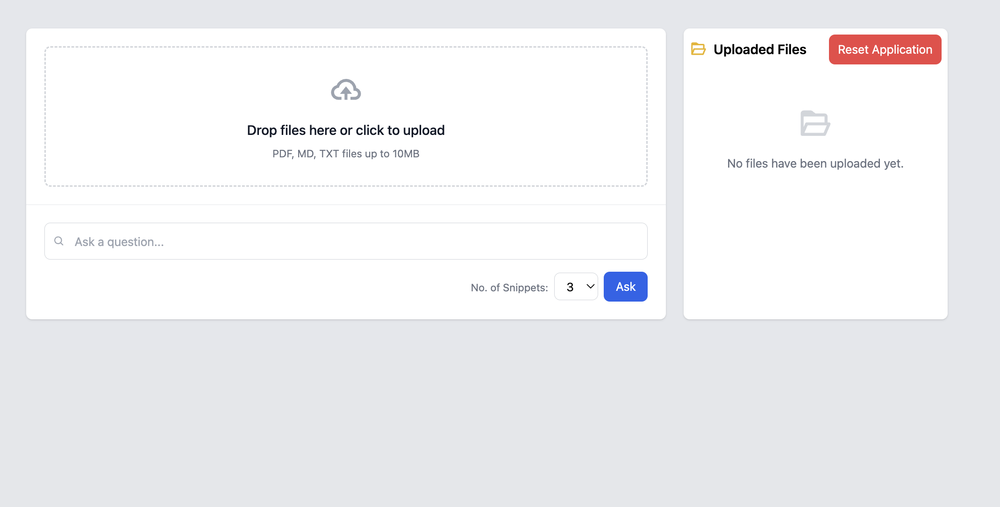
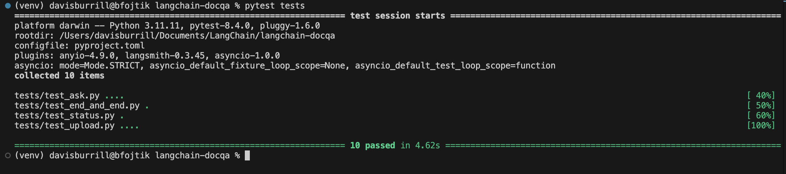

# LangChain DocQA

**A simple yet powerful document Q&A app that allows users to upload PDFs, TXT, or Markdown files and ask questions over them using LLM-powered search and retrieval. Powered by LangChain, ChromaDB, OpenAI, and FastAPI, with React + Tailwind frontend.**

## Table of Contents

1. [Overview / How It Works](#overview--how-it-works)  
2. [Live Demo / Screenshots / Video](#live-demo--screenshots--video)  
3. [Features](#features)  
4. [LangSmith Integration](#langsmith-integration)  
5. [Project Structure](#project-structure)  
6. [Tech Stack](#tech-stack)  
7. [Setup Instructions](#setup-instructions)  
8. [Running Tests](#running-tests)  
9. [Code Quality](#code-quality)  
10. [Future Improvements / Roadmap](#future-improvements--roadmap)  

## Overview / How It Works

LangChain DocQA is an end-to-end document question-answering app powered by FastAPI, LangChain, ChromaDB, and OpenAI, with a responsive React + Tailwind frontend. It allows users to upload documents, ask natural language questions, and receive real-time, streamed responses with cited source snippets and relevance scores.

### End-to-End Flow

1. **Upload a document**  
   Drag and drop a PDF or text file via the frontend.

2. **Ingest into ChromaDB**  
   The file is chunked, embedded using OpenAI, and stored in a local Chroma vector database.

3. **Ask a question**  
   The user submits a question, triggering a retrieval-augmented generation (RAG) pipeline.

4. **Get answer + context**  
   The app returns a real-time, token-streamed answer along with relevant source snippets—color-coded by confidence score.
   

### Frontend–Backend Communication

- **Frontend:** Built with Vite, React, and TailwindCSS for fast and responsive UI.
- **Backend:** FastAPI handles ingestion, storage, and question-answering logic via LangChain.
- **Communication:** Axios requests handle uploads, questions, and streaming responses from FastAPI endpoints.

###  Real-Time Feedback

- The app streams the OpenAI LLM response as tokens arrive.
- Color-coded sources provide instant insight into the confidence of retrieved document chunks.

### LangSmith Integration

- Full LangChain trace tracking is available for every query (when enabled).

## Live Demo

See the app in action from start to finish in this short walkthrough:

[](https://youtu.be/6EuDse0p2AI)

> Upload a document → Ask a question → Get an instant AI-powered answer with source context.

This demo covers:
- Uploading a document
- Real-time question answering with OpenAI
- Color-coded source relevance
- Vector store management
- LangSmith trace integration (if enabled)

Try it yourself locally by following the setup instructions below.

## Features

- **Drag-and-Drop File Upload**  
  Easily upload PDF or text files to populate your vector store.
  

- **FastAPI-Powered Ingestion**  
  Documents are processed, chunked, embedded with OpenAI, and stored in ChromaDB.
  

- **Natural Language Question Answering**  
  Ask questions in plain English and receive streamed responses from an LLM with cited sources.

- **Source Snippet Display with Score-Based Coloring**  
  Each answer includes context snippets from the original document, highlighted in:
  - 🟢 Green (high confidence)
  - 🟡 Yellow (moderate confidence)
  - 🔴 Red (low confidence)

- **LangSmith Tracing**  
  Visualize full LangChain traces for every question when enabled.

- **Full Test Suite**  
  End-to-end testing with `pytest` and `httpx`, including file upload, ingestion, and query routes.

- **Clean Codebase**  
  - Backend passes `pylint` with a score of **9.77/10**
  - Frontend uses `ESLint` and `Prettier` for consistent, readable code.

- **Vector Store Management UI**  
  Manage stored documents directly from the frontend interface — reset and test easily.
  

- **Streamed LLM Responses**  
  Token-by-token streaming from OpenAI provides fast and interactive answers.

- **Responsive UI with TailwindCSS**  
  Optimized for smooth, mobile-friendly use.

## LangSmith Integration

This project supports full LangSmith tracing to help visualize and debug LangChain workflows in real-time.

When enabled, every question asked through the UI is automatically traced and logged with:

- **Chain execution steps**
- **LLM calls**
- **Inputs and outputs**
- **Token usage and timing**

This is especially useful for developers looking to optimize chains or understand how their data is being processed.

### How to Enable

To activate LangSmith tracing:

1. Copy your LangSmith API key from [LangSmith](https://smith.langchain.com/).
2. In your `.env` file, set the following variables:

```env
LANGSMITH_TRACING=true
LANGSMITH_ENDPOINT="https://api.smith.langchain.com"
LANGSMITH_API_KEY=your_langsmith_api_key
LANGSMITH_PROJECT=your_langsmith_project
```

Traces will then appear in your LangSmith dashboard automatically when you run the app locally.


> Tip: LangSmith is optional, the app runs fine without it, but enabling it gives you deeper insight into how the app works behind the scenes.

## Project Structure

```
├── README.md                    # Project documentation
├── app/                         # FastAPI backend
│   ├── main.py                  # API entrypoint
│   ├── ingest.py                # Handles document ingestion into vector DB
│   ├── qa_chain.py              # LangChain QA chain logic
│   ├── vector_store.py          # ChromaDB vector storage handler
│   └── utils/                   # Helper functions (env loading, file parsing)
├── langchain-docqa-frontend/   # React + Vite frontend
│   ├── index.html               # Entry HTML file
│   ├── package.json             # Frontend dependencies
│   ├── vite.config.js           # Vite dev server config
│   ├── tailwind.config.js       # TailwindCSS config
│   ├── postcss.config.js        # PostCSS setup
│   └── src/                     # React source files
│       ├── App.jsx              # Main app component
│       ├── main.jsx            # Entry point for React
│       ├── index.css           # Global styles
│       └── components/         # UI components
│           ├── FileUpload.jsx
│           ├── QuestionForm.jsx
│           └── VectorStoreManager.jsx
├── uploaded_docs/              # User-uploaded files (empty but tracked)
├── vector_store/               # ChromaDB database (contains chroma.sqlite3)
├── test_files/                 # Sample files for ingestion
├── tests/                      # Backend test suite (pytest)
│   ├── conftest.py
│   ├── test_ask.py
│   ├── test_end_and_end.py
│   ├── test_status.py
│   ├── test_upload.py
│   └── test_files/             # Re-used test input files
├── requirements.txt            # Python dependencies
├── pyproject.toml              # Linting / formatting configuration
└── .env.example                # Sample environment variables
```

## Tech Stack

### Backend

* **Python** – Core programming language
* **FastAPI** – High-performance API framework
* **LangChain** – Framework for LLM-powered applications
* **OpenAI API** – LLM completions and streaming responses
* **ChromaDB** – Local vector database for document embeddings
* **Uvicorn** – ASGI server for running FastAPI

### Frontend

* **React** – Component-based UI framework
* **Vite** – Lightning-fast development server and build tool
* **Tailwind CSS** – Utility-first CSS for custom styling
* **ESLint** – JavaScript/JSX code linter
* **Prettier** – Code formatter for consistent styling

### Testing

* **pytest** – Python testing framework
* **httpx** – Async-compatible HTTP client for test requests
* **pytest-asyncio** – Async test runner for FastAPI routes

### Code Quality

* **pylint** – Python linter (project score: *9.77/10*)
* **black + isort** – Automated code formatting and linting for Python
* **Prettier + ESLint** – Automated code formatting and linting for frontend

### Tooling

* **LangSmith** – Real-time LangChain tracing and debugging
* **dotenv** – Environment variable management
* **Git** – Version control
* **Node.js / npm** – Frontend package management

## Setup Instructions

Follow these steps to run the app locally on your machine.

### Prerequisites

Make sure you have the following installed:

* **Python 3.12+**
* **Node.js 18+**
* **npm** (comes with Node.js)
* `git` (for cloning the repo)
* An OpenAI account + API key

### 1. Clone the Repository

```bash
git clone https://github.com/your-username/langchain-docqa.git
cd langchain-docqa
```

### 2. Set Up Environment Variables

Copy the `.env.example` and fill in your keys:

```bash
cp .env.example .env
```

Inside `.env`, provide the following:

```env
LANGSMITH_TRACING=true
LANGSMITH_ENDPOINT="https://api.smith.langchain.com"
LANGSMITH_API_KEY=your_langsmith_api_key
LANGSMITH_PROJECT=your_langsmith_project
OPENAI_API_KEY=your_openai_api_key
```

### 3. Install and Run the Backend

```bash
# Create virtual environment
python -m venv venv
source venv/bin/activate   # On Windows: venv\Scripts\activate

# Install dependencies
pip install -r requirements.txt

# Start the backend server
uvicorn app.main:app --reload
```

The backend will start at: [http://127.0.0.1:8000](http://127.0.0.1:8000)

---

### 4. Install and Run the Frontend

```bash
cd langchain-docqa-frontend

# Install frontend dependencies
npm install

# Start the frontend development server
npm run dev
```

The frontend will start at: [http://localhost:5173](http://localhost:5173)

---

### You're Ready!

Visit [http://localhost:5173](http://localhost:5173) in your browser and:

1. Upload a document (PDF, TXT, MD)
2. Ask any question about the contents
3. Get an LLM-powered answer with color-coded source scoring!

## Running Tests

This project includes a full backend test suite to ensure everything works smoothly from file ingestion to question answering.

### Run All Tests

From the project root, run:

```bash
pytest tests/
```


### What’s Covered?

* **Unit tests** for:

  * File uploads
  * Status checks
  * Vector store functionality
* **End-to-end (E2E) tests** for:

  * Uploading documents and asking questions through the full API flow

### Tools Used

* `pytest` for running the test suite
* `httpx` for making async test requests to the FastAPI app
* `pytest-asyncio` for testing async code

> All test files are located in the `tests/` directory. A few sample files are available in `test_files/` to try it yourself.

## Code Quality

This project emphasizes clean, maintainable code across both the backend and frontend.

### Python

* **Pylint Score:** `9.77/10` – high compliance with Python best practices

* Additional tools:

  * `isort` for auto-formatting imports
  * `black` for auto-formatting
* Configured via `pyproject.toml` for consistency and reproducibility

### Frontend (React)

* **ESLint**: Set up to follow recommended rules and ensure clean JavaScript
* **Prettier**: Enforces consistent formatting across all `.js`, `.jsx`, and `.css` files

### Extras

* Zero known linting errors at time of writing
* Strict separation of concerns between backend and frontend
* Fully typed and structured API with FastAPI + Pydantic

## Future Improvements / Roadmap

While this project is fully functional, there are several exciting enhancements I plan to add next:

### User Experience

* [ ] **User Authentication** – Enable login and user-specific document histories
* [ ] **Multi-file Querying** – Allow asking questions across multiple uploaded documents
* [ ] **Search History** – Let users view or revisit previous Q\&A sessions

### Deployment

* [ ] **Docker Support** – Containerize backend and frontend for easier deployment
* [ ] **CI/CD Integration** – Add GitHub Actions for linting, testing, and deploy automation
* [ ] **Cloud Hosting** – Deploy backend to Azure and frontend to Vercel for live access

### Advanced Features

* [ ] **Document Preview** – Display uploaded file content in-browser
* [ ] **Citation Support** – Add precise source referencing in answers
* [ ] **OpenRouter / Claude / Gemini** – Optional support for additional LLM providers

> Have suggestions? Open an issue or fork the repo!

